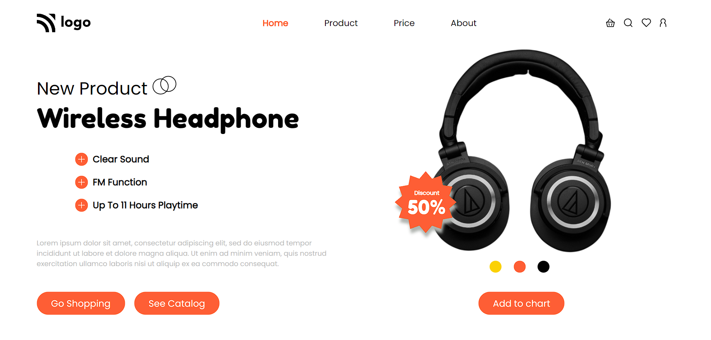

# Product Homepage

> ## [Mansi Gupta](https://twitter.com/butwhymansi)

 

## Tech Stack:

### _Live Hosted Link 🚀_ : _[Product Homepage]()_

## How the website looks like:

## My Learnings

-   Skills Gained in this project
    -   Learned how we can use **position Relative & Absolute in combination** so that items can be stacked on top of each other
    -   Learned to add **shadows** onto svgs
    -   Learned about **media queries**.
---